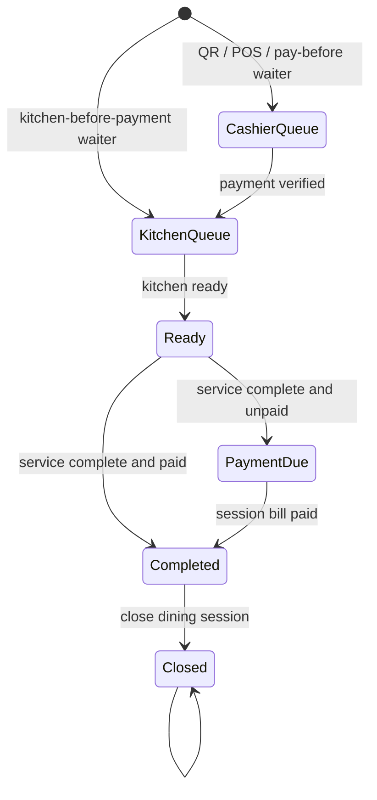

# Order Workflow Engine

## Architecture freeze

`OrderWorkflowEngine` is ServeFlow's sole authority for deciding where a dining
session moves next. UI modules, services, repositories, realtime consumers and
RPCs may observe facts, persist commands, and render the returned decision; they
must not reproduce source/payment/policy routing rules.

The engine has two equivalent boundaries:

- `src/core/workflow/orderWorkflowEngine.ts` is the pure, deterministic client
  and test boundary.
- `public.resolve_order_workflow(jsonb)` is the authoritative database boundary
  for RPCs, triggers, queues, external integrations, and server-side consumers.

Both accept canonical facts and return a decision. Neither reads the clock,
React state, routes, browser state, or global tenant state. The caller must pass
the restaurant ID and that restaurant's persisted waiter policy.

## Responsibilities

The engine owns:

- source-specific payment gates;
- the restaurant's waiter policy;
- cashier versus kitchen routing;
- ready, payment-due, completed, and closed destinations;
- whether kitchen release is allowed;
- whether payment is due; and
- whether a completed dining session should be closed.

The engine does not own authentication, price calculation, payment processing,
kitchen station assignment, inventory, recipes, rendering, or transport.

## Canonical input and output

Input is a dining-session snapshot: `restaurantId`, `waiterPolicy`,
`orderSource`, `diningSessionState`, aggregate `paymentStatus`, and aggregate
`kitchenStatus`. Additional orders are batches attached to the same dining
session; they do not create an independent workflow authority.

Output is `nextState`, `releaseToKitchen`, `paymentRequired`,
`closeDiningSession`, and a diagnostic `reason`. Consumers obey flags and must
not infer a different route from raw statuses.

## Workflow policy snapshot

Restaurant settings are creation-time defaults, not runtime workflow state.
When a dining session opens, the order row permanently records:

- `workflow_policy_snapshot` (`pay_before_kitchen` or
  `kitchen_before_payment`);
- `workflow_version`;
- `workflow_captured_at`; and
- the existing tenant-owned `restaurant_id`.

Every invoice, appended waiter order, and kitchen batch in that dining session
inherits this snapshot. Runtime gates, queue transitions, and workflow read
models must use the snapshot and must never read `restaurants.payment_policy`.
Changing settings therefore affects only dining sessions created afterward.

Existing sessions were backfilled from their persisted `payment_timing`, which
records how they actually started. They were deliberately not backfilled from
the restaurant's current setting.

The snapshot is immutable. Future workflow revisions increment
`workflow_version`; old sessions continue under the resolver semantics for the
version they captured. A version migration must never silently reinterpret an
active session.

## State diagram



## Workflow diagrams

```text
Customer QR: Order -> Cashier Queue -> Paid -> Kitchen Queue -> Ready -> Completed
Waiter/pay before: Order -> Cashier Queue -> Paid -> Kitchen Queue -> Ready -> Completed
Waiter/kitchen first: Order -> Kitchen Queue -> Ready -> Payment Due -> Paid -> Closed
Cashier POS: Order -> Cashier Queue -> Paid -> Kitchen Queue -> Ready -> Completed
```

Customer QR is permanently pay-before-kitchen. Only waiter orders may use
`kitchen_before_payment`. Mixed mode is unsupported. Unknown/future sources
default safely to payment before kitchen until an explicit engine rule is added.

## Developer rules

1. Never branch on order source plus payment/policy outside the engine.
2. Never decide queue membership from raw status fields in a module.
3. Aggregate facts at dining-session scope and call `resolve` or
   `public.resolve_order_workflow`.
4. Treat `releaseToKitchen` as the only kitchen-release decision.
5. Keep tenant policy persisted per restaurant; never use a process-wide mode.
6. Realtime transports facts or invalidation events only. On change, resolve
   again; realtime does not decide the transition.
7. UI labels may map a returned state to presentation, but may not change it.
8. A new workflow rule requires engine tests and database parity tests.
9. Restaurant policy is read exactly once, during dining-session insertion.
10. Invalid kitchen transitions roll back atomically; their batch remains in its
    current state and visible in the same station queue.

## Extension guide

To add Online Ordering, Delivery, Hotel PMS, Corporate API, room charge, or
corporate credit:

1. Add/confirm the canonical source identifier.
2. Define its payment/release semantics in both engine boundaries.
3. Add table-driven tests for unpaid, paid, ready, completed, and closed facts.
4. Have the adapter map external facts to canonical input.
5. Persist and publish the returned decision; do not embed routing in the adapter.

If a future integration needs a genuinely new state, add it to the engine output
contract first, migrate database consumers, then update presentation mappings.

## Future integration points

Inventory, recipes, purchasing, reports, corporate credit, room charge, Hotel
PMS, analytics, notifications and realtime consume workflow decisions or emitted
decision snapshots. They may react to `kitchen_queue`, `completed`, or `closed`,
but cannot independently derive those states. The database
`get_dining_session_workflow` function is the read boundary for authenticated
staff consumers that need the current resolved decision.

## Verification

Dedicated tests live in `tests/unit/order-workflow-engine.test.ts`. Architecture
contracts verify database delegation and prevent source/payment policy branches
from returning to runtime modules. Migration 165 installs the central database
resolver and delegates the legacy payment-timing adapter and kitchen gate to it.
